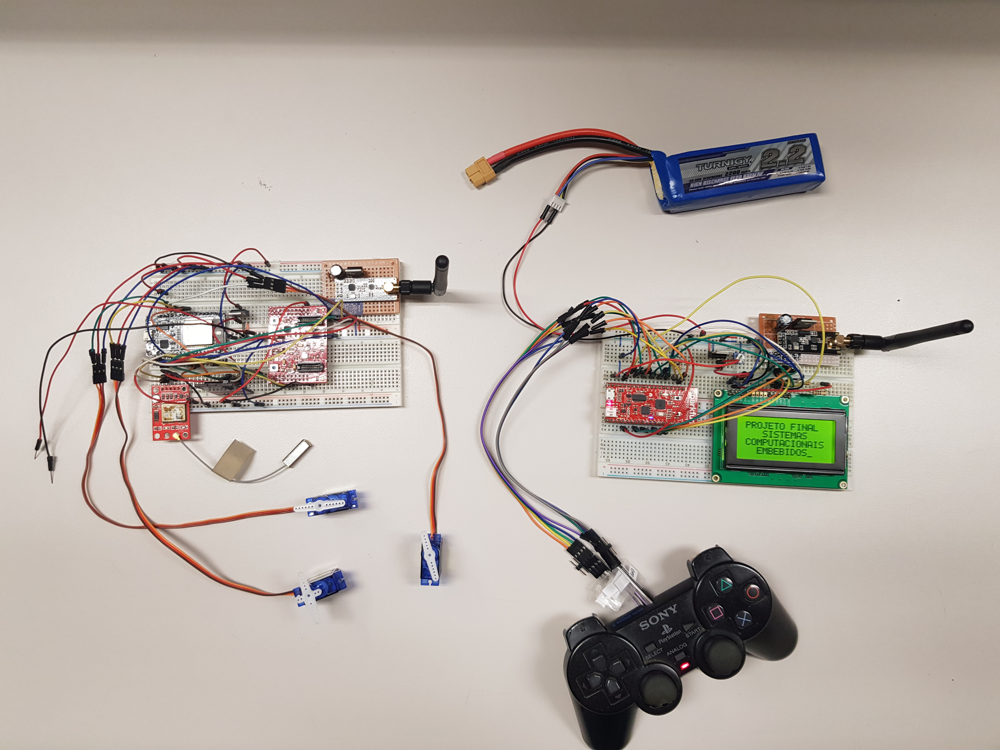
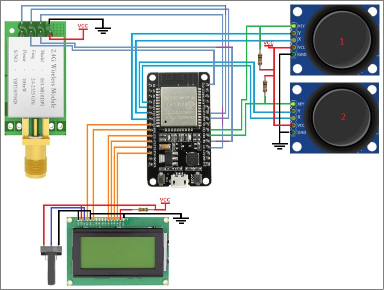

# 2.4GHz-embedded-radio-control-system-with-telemetry
Embedded real-time operating system using FreeRTOS. 
The system features: 
  Two 2.4GHz RF modules for long-range communication.
  Two ESP32 microprocessors for signal processing and control. 
  An integrated board, TI's Sensor hub booster pack, with multiple sensors such as pressure, humidity/temperature,gyroscope and accelerometer.
  A GPS module and a microSD card module in order to store the data.
All of the data measured by the sensors is constantly being transmitted and displayed on the LCD (Telemetry).

All of the code was developed using Sloeber, an Eclipse IDE.
You can watch the system in action here: https://www.youtube.com/watch?v=ApxDdUlQ5Mk

Here you can see the schematics of the system:

